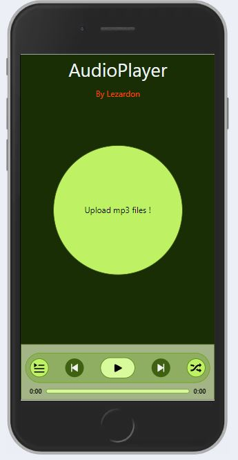
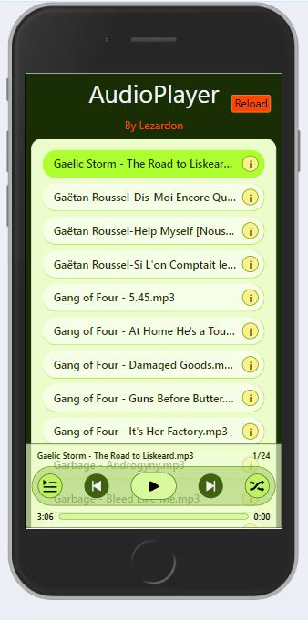
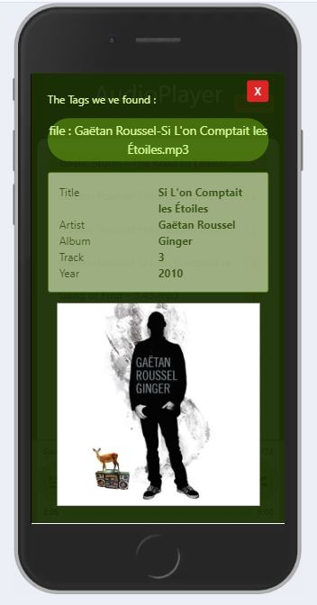

# AudioPlayerByLezardon

Projet proposé par l'Ecole du Web. j'ai ajouté les contraintes suivantes :

- chargement de fichiers mp3
- affichage des tags mp3

  
  
  

## Problèmes non encore résolus

Un appui sur pause effectue un stop

### `lezardon`

Open [https://laurent-lezardon.github.io/AudioPlayerByLezardon/](https://laurent-lezardon.github.io/AudioPlayerByLezardon/) to view it in your browser.
